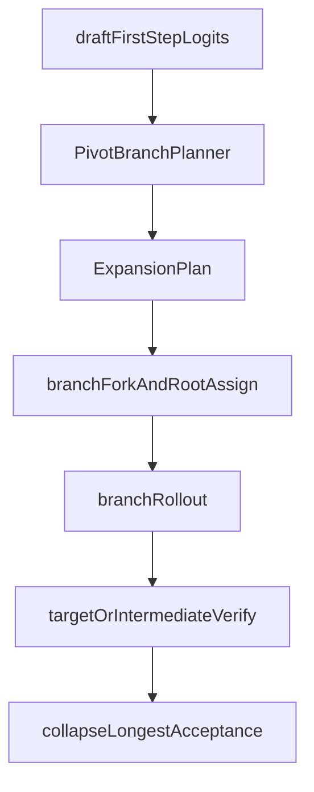

# Pivot / pivot_hierarchical 리팩터링 계획 (fused HV + planner 중심)

## 현재 코드 기준 사실 (소스 오브 트루스)

- **Fused hierarchical는 이미 step 레이어에 존재한다.** [`ssd/engine/step.py`](ssd/engine/step.py)의 `HierarchicalFusedStep`은 한 번의 `decode()` 안에서 `u in range(r)`마다 `_hv_rollback_committed_tape` → `speculate` → `VerifierHierarchical.verify_intermediate_round` → 스케줄러 `_hv_apply_local_intermediate_round`를 반복하고, 마지막에 타깃용 `speculate` → `verify_target_round` → `postprocess_hv_target_round`를 호출한다.
- **엔진 wiring은 fused step을 선택한다.** [`ssd/engine/llm_engine.py`](ssd/engine/llm_engine.py)에서 `config.spec_policy == "hierarchical"`이면 `HierarchicalFusedStep`을 반환한다(`hv_ignore_intermediate_eos` 강제 포함).
- **스케줄러는 fused 상한을 이미 반영한다.** [`ssd/engine/scheduler.py`](ssd/engine/scheduler.py)의 sync + hierarchical 분기에서 `fused_upper = hv_target_lookahead_upper()`로 target/draft/intermediate lookahead를 동일 상한에 맞춘다.
- **`VerifierHierarchical`는 round primitive를 갖되**, 공개 `verify()`는 여전히 “이번 호출이 intermediate냐 target이냐” 한 라운드용으로 남아 있다. **다중 서브라운드 오케스트레이션의 중심은 fused 경로에서 step이다.**

이전 문서 초안이 “엔진이 아직 SpecDecodeStep + 단일 verify에 가깝다”고만 적혀 있었다면 **현재 트리 기준으로는 구식**이다. 다만 **pivot_hierarchical를 설계할 때는 이 fused 오케스트레이션을 전제로 맞춰야** 이전 계획의 “hierarchical executor 위에 pivot만 얹기”가 코드와 맞물린다.

## 그대로 유지할 축

1. **`spec_policy_traits.py` 등 PolicyTraits** — raw `spec_policy` 문자열 비교 제거.
2. **pivot branch = step-local ephemeral** — scheduler queue에는 parent sequence만 유지.
3. **`BlockManager` fork/refcount API** — `clone_spec()`만으로는 block ownership 분리 불가.
4. **`SpeculateResult` / `VerifyResult` 확장** — `branch_bundle` 및 collapse/profiler 메타 필요.
5. **레거시 `VerifierPivot` 분리** — async/spec_hive 의미와 새 pivot 의미 분리.
6. **`pivot_hierarchical`의 fused step 구현** — `HierarchicalFusedStep`와 동형 루프 유지.

## 이번 수정의 핵심: Expansion Planning Layer 분리

- expansion policy(`policy/criteria/pct/threshold/topk`)는 speculator detail이 아니라 **독립 planning layer**다.
- 이 로직은 `SpeculatorSync`, `VerifierPivot`, `VerifierHierarchical`에 넣지 않고 **`pivot_branch_planner.py`로 단일화**한다.
- 실행 토폴로지는 아래로 고정한다.

- planner 산출은 flat pivot과 pivot_hierarchical fused subround에서 모두 재사용한다.

## `postprocess_mode` vs fused 서브라운드

- **Non-fused `SpecDecodeStep` 경로**(default / pivot / pivot_legacy 등): `postprocess_mode`로 `postprocess_speculate` vs HV 분기를 정리하기 좋다.
- **Fused `HierarchicalFusedStep` 경로**: 이미 서브라운드 인덱스와 스케줄러 헬퍼가 진실이므로, pivot_hierarchical에서는 **branch-local 서브라운드 상태(클론별 `hv_*`, `num_inter_cached_tokens` 등)**가 `postprocess_mode`보다 실행 정확도에 더 직접적이다. `postprocess_mode`는 프로파일/디버그·단일 라운드 verifier 호환용으로 유지할 수 있다.

## 정책 모델 (외부 이름 vs 내부 축)

제품 결정(이전과 동일): **`spec_policy=pivot` = 새 동기식 root expansion + collapse**; 기존 async+spec_hive는 **`pivot_legacy`** 등으로만 노출.

내부 축:

- `uses_hierarchical_verify(policy)` — HV 인프라 + (현재) `HierarchicalFusedStep` 게이트
- `uses_pivot_root_expansion(policy)` — root branch expansion 활성

매핑 예: `pivot_hierarchical` → 둘 다 True; `hierarchical` → HV만 True; `pivot` → expansion만 True; `pivot_legacy` → 둘 다 False(레거시 경로).

`config.py`에는 필드·검증만 두고, 문자열→bool 매핑은 [`ssd/engine/spec_policy_traits.py`](ssd/engine/spec_policy_traits.py)에 집중한다.

## Config 추가 필드 (planner 전용)

- `pivot_expansion_policy: Literal["static","dynamic"] = "dynamic"`
- `pivot_expansion_criteria: Literal["top1","residual"] = "residual"`
- `pivot_expansion_pct: float = 0.0`
- `pivot_expansion_threshold: float = 0.8`
- `pivot_topk: int = 5`

검증:

- `pivot_expansion_policy in {"static","dynamic"}`
- `pivot_expansion_criteria in {"top1","residual"}`
- `0.0 <= pivot_expansion_pct <= 1.0`
- `0.0 <= pivot_expansion_threshold <= 1.0`
- `pivot_topk >= 1`

정책별 필드 사용 범위:

- `pivot_expansion_policy == "static"`: `pivot_expansion_pct`만 사용, `pivot_expansion_threshold`는 무시
- `pivot_expansion_policy == "dynamic"`: `pivot_expansion_threshold`만 사용, `pivot_expansion_pct`는 무시
- unused 필드는 에러로 막지 않고 디버그 경고를 남기는 방향 권장

주의:

- generic 이름(`threshold`, `expansion_pct`) 재사용 금지. 레거시 `VerifierPivot`와 혼동되므로 반드시 `pivot_` prefix 사용.
- `pivot_topk == 1`은 허용(no-op에 가까움), 디버그 로그 권장.

## PivotBranchPlanner API (신설)

- 파일: [`ssd/engine/pivot_branch_planner.py`](ssd/engine/pivot_branch_planner.py)
- 입력/출력 dataclass:
  - `PivotExpansionConfig(policy, criteria, expansion_pct, threshold, topk)`
  - `PivotExpansionPlan(parent_batch_size, expanded_batch_size, expand_mask, parent_index_per_branch, branch_index_per_parent, root_token_ids, root_token_probs, criteria_scores, top1_probs, residual_scores, branch_counts)`
- 함수:
  - `build_pivot_expansion_plan(first_step_logits, cfg, *, max_expand_rows=None) -> PivotExpansionPlan`

criteria 정의:

- `top1`: `score = p1`
- `residual`: `score = p1 - p2`
- 공통: score가 낮을수록 불확실 → 확장 우선순위 높음.

selection:

- `static`: `ceil(B * pivot_expansion_pct)`개를 low-score 순으로 확장
- `dynamic`: `score < pivot_expansion_threshold`를 확장
- expanded request는 top-k root 후보, non-expanded는 top1 단일 후보 유지

fused step 적용 규칙(v1):

- **한 fused engine step 안에서 planner 실행은 1회(첫 subround)** 로 제한
- 이후 intermediate subround에서는 새 재확장을 금지하고, 첫 subround에서 생성한 branch family를 유지
- 마지막 target subround에서만 collapse 수행

## Capacity clamp (planner 후처리)

planner 출력 후 `apply_capacity_limit()`를 반드시 통과:

1. requested expanded rows
2. CUDAGraph max rows
3. free KV blocks / max_model_len
4. 초과분 request를 branch_count=1로 downgrade

downgrade 우선순위:

- dynamic/static 모두 low-score request를 우선 유지하고 나머지 확장 해제(결정 순서 deterministic).

## 데이터 타입 · 블록 · 팩토리

- [`ssd/engine/pivot_types.py`](ssd/engine/pivot_types.py): `BranchForkState`, `PivotBranchBundle`, collapse decision 구조체.
- [`ssd/engine/helpers/speculate_types.py`](ssd/engine/helpers/speculate_types.py): `branch_bundle`, `postprocess_mode`, (선택) fused 프로파일용 필드; `VerifyProfileTrace` pivot 확장.
- [`ssd/engine/block_manager.py`](ssd/engine/block_manager.py): fork/ref_count API.
- [`ssd/engine/spec_decode_components.py`](ssd/engine/spec_decode_components.py)(가칭): `build_spec_components` — **동기 spec의 step 클래스 선택까지 포함**할지(`SpecDecodeStep` vs `HierarchicalFusedStep` vs 향후 `PivotHierarchicalFusedStep`) 여기서 한곳으로 모으는 것이 좋다.

## 수정된 구현 순서 (planner 독립 phase 반영)

1. **Phase 1: traits + config**
   - `spec_policy_traits.py` 도입, raw string 분기 제거
   - `pivot_hierarchical`, `pivot_legacy` 정책 추가
   - planner 전용 config 5개 필드 + validation 추가
2. **Phase 2: pivot planner unit test**
   - `pivot_branch_planner.py` 먼저 구현
   - 케이스: static/dynamic × top1/residual, pct/threshold, topk rows, capacity clamp, deterministic tie
3. **Phase 3: types 확장**
   - `PivotExpansionPlan`/`PivotBranchBundle` 연결
   - `SpeculateResult.branch_bundle`(+planner metadata) 추가
4. **Phase 4: block fork API**
   - `fork_shared_prefix` / private tail / `release_fork`
5. **Phase 5: flat pivot 구현**
   - `PivotRootSpeculatorSync`: first-step logits -> planner -> branch fork -> rollout
   - `pivot_executor_flat`: expanded verify 후 parent collapse
6. **Phase 6: hierarchical fused 정합 마일스톤**
   - `pivot_hierarchical`는 fused step 확장 경로로 고정
   - 필요 시 `HierarchicalFusedStep` 서브라운드 루프를 protected 메서드로 추출
7. **Phase 7: pivot_hierarchical 구현**
   - v1 기본안: fused step의 첫 intermediate subround에서만 planner 실행(단일 root expansion)
   - 이후 intermediate subround는 branch family 유지 + branch-local 상태만 갱신
   - target subround에서만 collapse + `postprocess_hv_target_round`
8. **Phase 8: CUDAGraph envelope**
   - v1 상한: `max_num_seqs * pivot_topk` (또는 `* min(pivot_topk, pivot_max_root_branches)`)
   - 주의: subround 재확장 semantics를 도입하면 상한이 `pivot_topk^r` 계열로 커지므로 v1 범위에서는 금지
9. **Phase 9: profiler + bench**
   - planner/branch 결정 필드 추가 및 스크립트 갱신

## collapse / tie-break 규칙

collapse primary:

1. target acceptance length 최대
2. target confidence(또는 verified prefix score) 최대
3. root token probability 최대
4. branch index 최소

주의:

- expansion criteria score는 parent request 확장 선택용이며, branch winner 선택의 1차 지표로 사용하지 않는다.

## 스케줄러와 branch 배수

- `hv_target_lookahead_upper()`는 **parent 한 줄** 기준 worst-case다. pivot root expansion이 있으면 **동일 parent에 대해 draft/target/inter 블록 소모가 배수로 늘 수 있음**.
- 1차 구현: **Planner가 블록/rows 여유 부족 시 branch_count=1로 fallback** (필수).
- v1은 step당 단일 expansion family를 유지하므로, branch 상한은 parent당 `pivot_topk`로 고정된다(서브라운드 재곱 증가 없음).
- 2차: `fused_upper` 또는 스케줄 분기에 **이론적 branch 상한**을 반영할지 검토(과도하게 보수적이면 throughput 저하).

## profiler / 관측성 필드

필수 기록:

- `pivot_expansion_policy`
- `pivot_expansion_criteria`
- `pivot_expansion_threshold`
- `pivot_expansion_pct`
- `pivot_topk`
- `pivot_criteria_score`
- `pivot_top1_prob`
- `pivot_residual_score`
- `pivot_expanded`
- `pivot_branch_count`
- `pivot_selected_branch_idx`
- `pivot_selected_root_token_id`

운영 로그(최소):

- `num_expanded_requests / B`
- `expanded_rows / B`
- criteria `mean/min/max`
- `capacity_downgraded_requests`

## 리스크 · 테스트

- **Fused step과 rollback 순서**: `HierarchicalFusedStep`은 매 서브라운드마다 tape rollback과 로컬 intermediate 적용이 엄격하다. pivot branch 클론은 **이 순서를 깨지 않도록** 같은 패턴으로만 돌린다.
- **단위 테스트**: traits 매핑, planner(selection/clamp/tie), tie-break, `block_manager` fork ref_count.
- **default 공격성 주의**: `dynamic + residual + threshold=0.8`는 과확장 가능성이 높다. default를 유지하더라도 planner clamp + 관측 로그는 필수.
- **Push는 사용자 승인 후**에만 수행.

## 요약 한 줄

구조 축(traits/types/fork/legacy 분리/fused 확장)은 유지하고, **expansion decision은 `pivot_branch_planner.py`가 전담**하도록 승격해 flat pivot과 pivot_hierarchical 모두 같은 planning layer를 소비하게 만든다.
